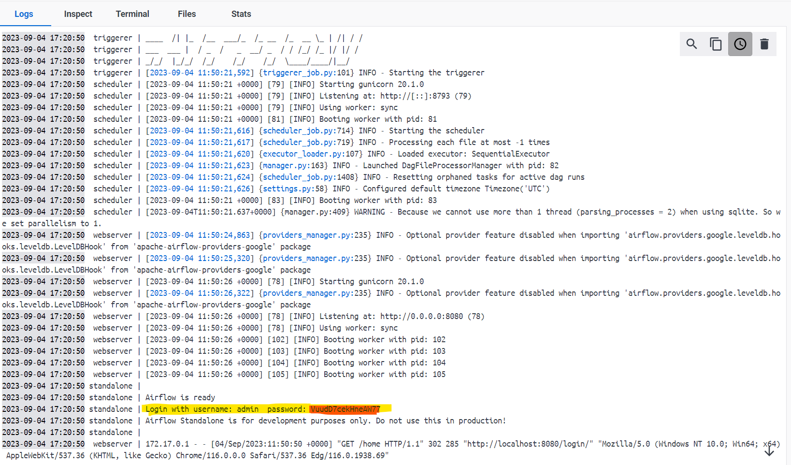
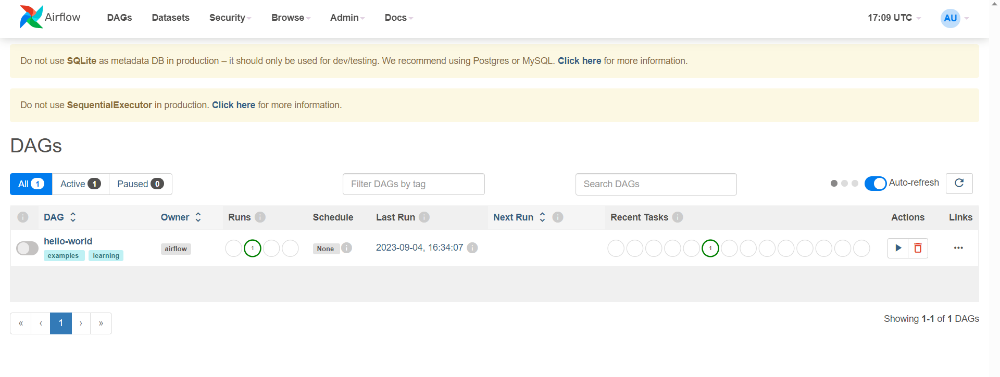
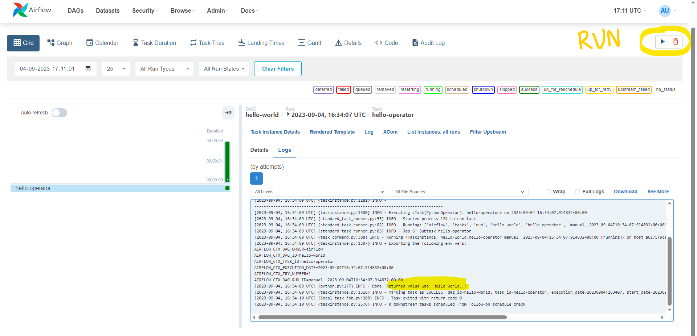

# airflow-examples
This repository provides you the standalone airflow setup which will be deployed using docker.
Just run docker file and standalone airflow will be running on your machine.

## What you will need
  - Docker 
  - Python 3.8+ and any Virtual Environment for python 

## How to use 
1. Clone the repository at desired location
2. Build the docker image 

    ```docker build . -t airflow-local```
3. Run the docker image

    ```docker run -p 8080:8080 -v /c/local/clone/path/airflow-examples/dags:/opt/airflow/dags  -d airflow-local```
    
    Here replace local path of airflow DAG's repository, so that if you made changes to dags in the folder we don't have to restart docker. 
4. After successful run, this will initialize airflow database, webserver and scheduler.
5. Airflow web ui would be started at http://localhost:8080/home 
6. Go to the container logs to note the airflow password to login the UI.
   
7. After successful login you should be able to see hello-world dag.
   
8. Run the hello-world dag by clicking on run button on right side, you should see output like below
   

## What next
   Add more DAG and have fun.